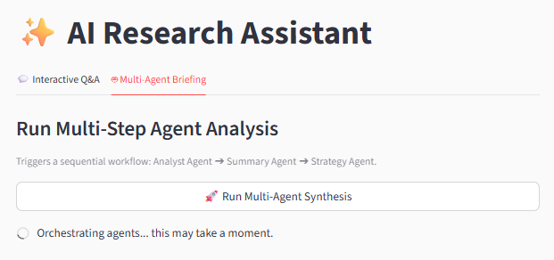
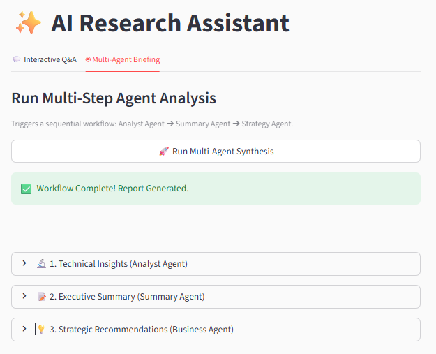
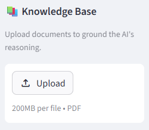
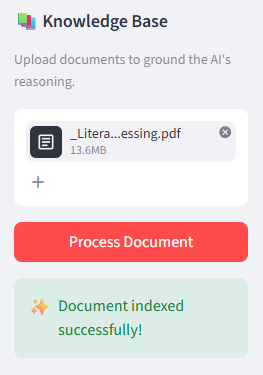
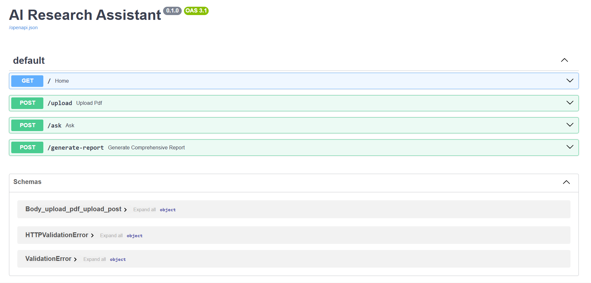

# **AI Research Assistant: Multi-Agent RAG Workflow**

<p align="center">
  <b>Enterprise Workflow Automation Prototype</b><br>
  Accelerating Document Analysis with Agentic AI & Semantic Retrieval
</p>

<p align="center">
  
  
  
  
  
  
</p>

<p align="center">
  
  
</p>

---

# 📌 Overview

This project presents a **production-ready AI workflow automation system** designed to process complex research documents.

Unlike standard conversational chatbots, this system utilizes a **Retrieval-Augmented Generation (RAG)** pipeline combined with a **Multi-Agent Orchestration Workflow**. It reads technical PDFs, retrieves context-aware information, and passes it through specialized AI agents *(Analyst, Summarizer, Business Strategist)* to automatically generate structured executive reports.

The architecture combines:

- **Gemini Flash Lite**
- **LangChain orchestration**
- **FAISS vector retrieval**
- **HuggingFace MiniLM embeddings**
- **FastAPI backend APIs**
- **Streamlit frontend interfaces**
- **Multi-Agent AI workflows**

---

# 🚀 Key Contributions

- ✅ **Multi-Agent Sequential Pipeline** for layered document synthesis
- ✅ **Stateless API Backend** using FastAPI for scalable deployment
- ✅ **Context-Aware Text Chunking** preserving semantic continuity
- ✅ **Custom Parsing Engine** for clean Markdown rendering
- ✅ **100% Free / Cost-Optimized Stack**
- ✅ **Containerized Architecture** ready for Docker deployment

---

# 🏗️ System Architecture

<p align="center">
  
</p>

<p align="center">
  <i>End-to-end Retrieval-Augmented Generation (RAG) workflow architecture</i>
</p>

---

# 🧠 RAG Workflow Pipeline

```text
User Query
   ↓
Streamlit Frontend
   ↓
FastAPI Backend
   ↓
PDF Parsing & Chunking
   ↓
MiniLM Embedding Generation
   ↓
FAISS Vector Store
   ↓
Semantic Retrieval
   ↓
LangChain Orchestration
   ↓
Gemini Flash Lite
   ↓
AI-Generated Research Insights
```

---

# 🖼️ Application Screenshots

## 💬 Interactive RAG Question Answering

<p align="center">
  
</p>

---

## 🤖 Multi-Agent Research Workflow

<p align="center">
  
  
</p>

---

## 📄 PDF Upload & Indexing

<p align="center">
  
  
</p>

---

## ⚙️ FastAPI Swagger Documentation

<p align="center">
  
</p>

---

# ⚡ Technical Stack & Performance

| Component | Technology | Role | Cost Profile |
| :--- | :--- | :--- | :--- |
| **LLM Engine** | Gemini Flash Lite API | Reasoning & Summarization | Free Tier |
| **Backend API** | FastAPI | Async routing & file handling | Open Source |
| **Frontend UI** | Streamlit | Interactive AI dashboard | Open Source |
| **RAG Framework** | LangChain | Agent orchestration & prompts | Open Source |
| **Vector Database** | FAISS | Semantic similarity retrieval | Local Compute |
| **Embeddings** | MiniLM-L6-v2 | Dense vector generation | Local Compute |

---

# 📂 Project Structure

```text
ai-research-assistant-workflow/
├── backend/
│   ├── main.py
│   ├── rag_engine.py
│   ├── agents.py
│   └── rag_pipeline.py
│
├── frontend/
│   └── app.py
│
├── docs/
│   ├── architecture.png
│   ├── screenshots/
│   ├── AI-Powered Research Assistant Report.pdf
│   └── AI-Powered Research Assistant Report.docx
│
├── uploaded_files/
├── requirements.txt
├── docker-compose.yml
├── Dockerfile
├── .env.example
└── README.md
```

---

# ⚙️ Setup & Installation

## 1️⃣ Clone Repository

```bash
git clone https://github.com/014-Jayal/ai-research-assistant-workflow.git
cd ai-research-assistant-workflow
```

## 2️⃣ Create Virtual Environment

### Windows

```bash
python -m venv venv
venv\Scripts\activate
```

### Linux / macOS

```bash
python3 -m venv venv
source venv/bin/activate
```

## 3️⃣ Install Dependencies

```bash
pip install -r requirements.txt
```

## 4️⃣ Configure Environment Variables

Create a `.env` file:

```env
GOOGLE_API_KEY=your_gemini_api_key_here
```

---

# 🐳 Docker Deployment

```bash
docker-compose up --build
```

---

# ▶️ Running the Application

## 🚀 Start FastAPI Backend

```bash
uvicorn backend.main:app --reload --port 8000
```

API Docs:
`http://localhost:8000/docs`

---

## 🎨 Start Streamlit Frontend

```bash
streamlit run frontend/app.py
```

Dashboard:
`http://localhost:8501`

---

# 🤖 Multi-Agent Workflow

| Agent | Responsibility |
|---|---|
| 🔬 Analyst Agent | Extract technical insights |
| 📝 Summary Agent | Generate executive summaries |
| 💡 Strategy Agent | Produce strategic recommendations |

---

# ⚡ Scalability & Future Improvements

- Pinecone / Weaviate integration
- Conversational memory
- Multi-document querying
- Enterprise authentication
- Cloud-native deployment
- Citation-aware responses

---

# 👨‍💻 Author

## Jayal Shah

- GitHub: https://github.com/014-Jayal
- LinkedIn: https://www.linkedin.com/in/jayal-shah04/

---

<p align="center">
  <b>Built with Gemini • LangChain • FastAPI • Streamlit • FAISS</b>
</p>
